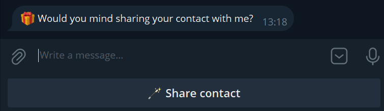
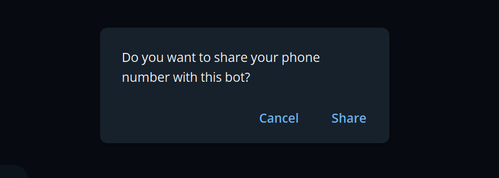
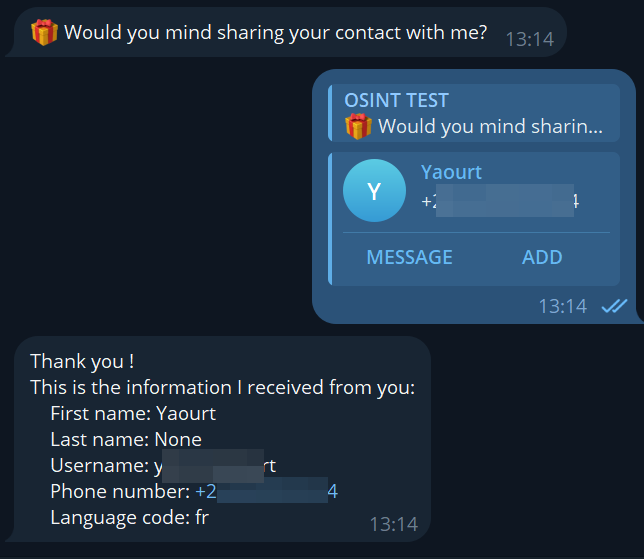

This bot shows how it is possible to ask a user to share its contact information to the bot, which also shares the phone number associated with that account. This can be used to deanonimize a target user using some social engineering techniques.

Three step process :

